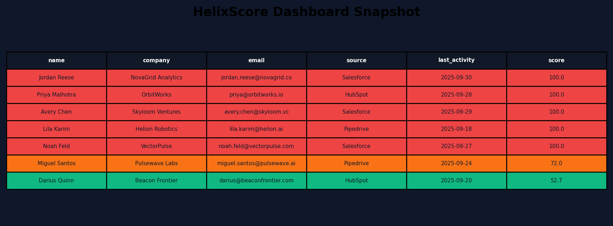

# HelixScore

HelixScore is a polished cross-CRM lead scoring engine designed for revenue teams juggling HubSpot, Salesforce, and Pipedrive. It unifies lead data, scores it with configurable rules (and optional LLM boosts), then broadcasts the hottest prospects to Slack or Microsoft Teams while showcasing everything inside a cinematic React dashboard.

<p align="center">
  
</p>

[](https://render.com/deploy)
[](https://fly.io/docs/apps/)

## 🧠 Stack
- **Backend:** FastAPI, Pydantic, Pandas, APScheduler, Matplotlib (for portfolio assets)
- **Frontend:** React (Vite) + TailwindCSS + Recharts
- **Notifications:** Slack & Microsoft Teams webhooks
- **Optional Assist:** OpenAI-driven “AI boost” to blend rule scores with GPT judgment

## ✨ Feature Highlights
- Live CRM ingestion adapters for HubSpot contacts, Salesforce leads, and Pipedrive deals (with graceful JSON fallback)
- Rule-based scoring engine + optional OpenAI blend for probability scoring
- Hygienic lead normalization & deduplication
- Trend visualizations, heat-mapped tables, and expandable lead drawers in the UI
- Scheduler that auto-sends top leads every 6 hours (interval configurable)
- Asset generator that produces dashboard, Slack, and console screenshots for your portfolio

## 🚀 Quickstart

### 1. Backend
```bash
python -m venv .venv
source .venv/bin/activate
pip install -r requirements.txt
uvicorn backend.main:app --reload
```

### 2. Frontend
```bash
cd frontend
npm install
npm run dev
```
Set `VITE_API_URL=http://localhost:8000` (or your deployed API) so the dashboard knows where to fetch data.

### One-Command Dev Loop
```bash
make helix
```
(press Ctrl+C to stop both servers)

### 3. Score a Batch
```bash
curl http://localhost:8000/score-leads \
  -X POST \
  -H "Content-Type: application/json" \
  -d @data/sample_leads.json
```

### 4. Trigger a Webhook Blast
```bash
export SLACK_WEBHOOK_URL="https://hooks.slack.com/services/..."
# Optional
export TEAMS_WEBHOOK_URL="https://outlook.office.com/webhook/..."

curl http://localhost:8000/broadcast -X POST -H "Content-Type: application/json"
```

### 5. Scheduler (Auto Broadcast)
```bash
export HELIX_ENABLE_SCHEDULER=true
export HELIX_SCHEDULER_INTERVAL_MINUTES=360  # every 6 hours
uvicorn backend.main:app --reload
```

### 6. Portfolio Assets (Screenshots)
```bash
.venv/bin/python -m helixscore.scripts.generate_assets
```
Outputs land in `artifacts/`:
- `dashboard_snapshot.png`
- `slack_hot_leads.png`
- `console_output.png`

## ⚙️ Environment Reference
```
HUBSPOT_API_KEY=
SALESFORCE_INSTANCE_URL=
SALESFORCE_ACCESS_TOKEN=
PIPEDRIVE_API_KEY=
SLACK_WEBHOOK_URL=
TEAMS_WEBHOOK_URL=
HELIX_AI_BOOST=false
HELIX_AI_MODEL=gpt-4.1-mini
HELIX_ENABLE_SCHEDULER=false
HELIX_SCHEDULER_INTERVAL_MINUTES=360
VITE_API_URL=http://localhost:8000
```

## 📦 Deploy Recipes
Deployment manifests live in [`deploy/`](deploy/):
- `render.yaml` spins up a Render web service (FastAPI + scheduler) and static build for the frontend.
- `fly.toml` bootstraps Fly.io deployment with two processes: `api` (FastAPI) and `web` (Vite static).
- `Procfile` shows the exact commands (`uvicorn` + `npm run preview`).

### Render TL;DR
```bash
cd helixscore
render blueprint deploy deploy/render.yaml
```

### Fly.io TL;DR
```bash
cd helixscore/deploy
fly launch --copy-config
fly deploy
```

## 🧪 Testing & Quality Gates
- Python suite: `.venv/bin/pytest helix/tests`
- Frontend unit snapshots: `cd frontend && npm run test:snapshot`
- Playwright UI run (auto in pytest fixture) or standalone: `cd frontend && npx playwright test`
- Scheduler + webhook behaviours mocked in tests for safe CI runs

## 📸 Portfolio Tips
- Screenshots are in `artifacts/`
- Walkthrough narration lives in [`portfolio/walkthrough_script.md`](portfolio/walkthrough_script.md)
- Need a GIF? Use `npm run dev` + `helixscore/scripts/generate_assets.py` for static capture, then OBS/Loom for live capture

## 🧳 Standalone Extraction
If you want to ship only the app, use [`README_extract.md`](README_extract.md) for a self-contained setup guide.

HelixScore is ready to paste into GitHub, show recruiters, and drop into your Upwork portfolio with a single click. 🖤
